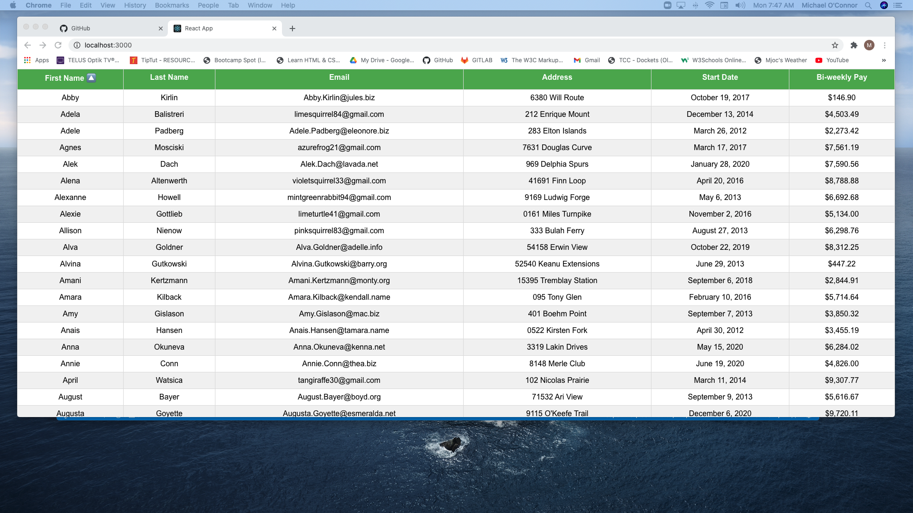

# React_Employee_Directory

This is the repo for the Employee Directory assignment 19, due March 19, 2021.

# Unit 19 REACT Homework: Employee Directory

Submitted: March xx, 2021, Michael O'Connor, 604 765-6061

# 01 Goal: 

    The goal of this project is to create an employee directory with React. This assignment
    requires us to break up our application's UI into components, manage component state, 
    and respond to user events.  Here is a link to the Github folder https://github.com/Emjayosee/19_React_Employee_Directory
    and a link to the deployed website https://emjayosee.github.io/19_React_Employee_Directory/.

# 02 Approach:

    In approaching this project, I began by attempting to convert one of the apps from the assignment from a serach for animals to a search for people (from Pupster).  But then I was not getting the flow and I needed to build a table.  So I examined a number of articles and a youtube video on REACT tables.  I followed this video to get tha basic table app to compile with a JSON file that I manually created based on family member data.  My next idea was to then create a mock data set from the recommended website and update the JSON file accordingly with mock data.  Once there I plan to adjust the look and feel of the app with a nav bar and some functionality, but time is of the essence and I must submit something once I have extracted enough learnings.

    I followed the following plan design:

            Goal:

            Create an employee directory and create a US that involves some USER events. 

            Design:

            [X]	 Establish a basic table.

            [ ]  Create a JSON file of at least 100 employees with randomized data.

            [ ] Enable an ability to search or sort the data by the user.

            [ ] It would be particularly helpful to be able to filter employees by name.
        
            
            Here is the basic logic flow :

                [ ] On load, display a navbar and the table of employee data. 

                [ ] User is advised to click the NAV BAR or top table row to:

                   - Sort the table by at least one category

                   - Filter the users by at least one property.

            Build:

            •	Set up a REACT environment fof the files and create some files to enable the file to render [ ]
            
            JS: Based on my readings and the class and youtibe video I watched:
            
                1. Create a json file with the relevant test data. [x]
                2. Define the columns [x]
                3. Us the data and columns to create a table instance using react-table [x]
                4. Define a table structure using plain html [x]
                5. Use the step 3 table instance to bring to life the html in step 4 [x]
                6. Include CSS formatting from W3Schools. [x]

            CSS:
                >Add a stylish background image and styling if time permits [x]
            

# 03 Testing and Quality Control:

    1. Test each of the criteria to confirm functionality.

    2. Format HTML Code to make it easier to follow when viewed at source.

    3. Load the files and tested the page functionality at GITHUB.

    4. Run NPM Build to ensure proper compling.

# 04 Lessons Learned:

The following lessons learned:

    1. How to build files in a REACT environment.

    2. Use of tables and hooks.

    3. Debugguing code.

    4. That there is a lot of power and development in the REACT library.

    5. How to deploy a site to GitHub Pages using the [Create React App docs for deployment.]
    (https://create-react-app.dev/docs/deployment/#github-pages).

    6. There are good instructions on table in react here https://react-table.tanstack.com/docs/quick-start.

    7. Another good example of sorting is from 6 link  useSortBy.

# 05 Further improvements to make:

The following items should be considered for future enhancements, time and budget permitting:

    1. Add an ability to sort data columns.

    2. Ability to filter employee data.

    3. Ability to create emails for phonecalls from the table data.

# 06 Current Renderings:

See Current Rendering at the time of writing in the Assignment19 Repo. 

